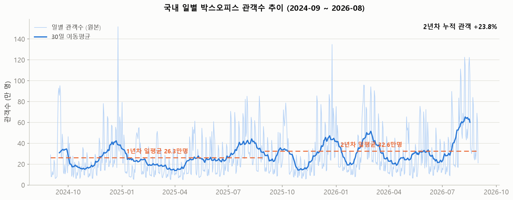
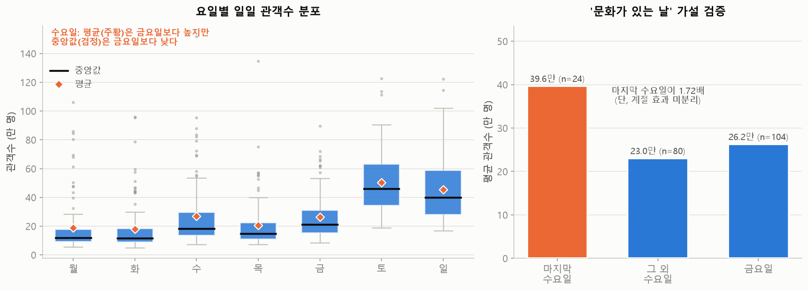
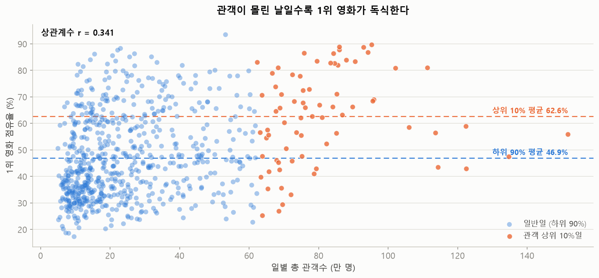

# 국내 박스오피스 시계열 분석 리포트 (2024-09 ~ 2026-08)

> 작성자: 주시호 · 작성일: 2026-09-19

---

## 1. 분석 주제 및 선정 이유

- **주제**: 2024년 9월부터 2026년 8월까지 국내 영화관 일별 관객수의 추세·요일 패턴·시장 집중도 분석
- **이 데이터를 고른 이유**: 영화 보는 것을 좋아하고 관심이 있어서 정하게 되었습니다. 사람이 언제 몰리는가를 알면 추후 영화를 볼 때 참고할 수 있을 것 같았습니다.

- **이 분석이 답을 주면 무엇이 달라지는가**: 영화를 예매하려는 사람들에게 참고할 만한 분석결과가 될 것이라고 생각합니다. 그리고 개봉일 선정, 마케팅 시점 등을 고려하는데 참고할 수도 있을 것 같습니다.

## 2. 분석 질문

| # | 질문 | 유형 | 답하는 방법(시각화/기법) |
|---|------|------|--------------------------|
| Q1 | 2년간 국내 영화 시장은 성장했는가? 추세 전환점이 있는가? | 추세 | 30일 이동평균 + 연도별 일평균 비교 |
| Q2 | 요일에 따라 관객수가 얼마나 다른가? 수요일이 금요일보다 높은 이유는? | 주기/집계 | 요일별 집계(평균·중앙값) + 박스플롯 |
| Q3 | 관객이 몰린 날은 한 영화의 독식인가, 여러 영화의 분산인가? | 사건/변동 | 전일 대비 변화율 + 1위 점유율 산점도 |

## 3. 데이터 설명

- **출처**: 영화진흥위원회 영화관입장권통합전산망(KOBIS) 오픈API — 일별 박스오피스
- **수집 방법**: `src/collect_boxoffice.py` (하루 1회 호출 × 730일, TOP10 원본 행 저장)
- **기간**: 2024-09-01 ~ 2026-08-31 (24개월, 730일)
- **데이터 포인트 수**: 원본 7,300행 → 일별 집계 **730개**
- **메인 시계열**: 일별 TOP10 관객수(`audiCnt`) 합계 = 시장 규모의 **대리 지표**
- **보조 지표**: 1위 영화 관객 점유율 = 시장 집중도
- **주요 컬럼**: `targetDt`(기준일), `rank`(순위), `movieNm`(영화명), `audiCnt`(당일 관객수), `audiAcc`(누적 관객수), `salesAmt`(매출액), `scrnCnt`(스크린수), `showCnt`(상영횟수)
- **라이선스/이용 조건**: 공공데이터포털 등록 기준 이용허락범위 제한 없음(무료). 다만 KOBIS 오픈API 이용약관 제6조 2항이 결과의 복제·저장·재전송을 제한하므로, **원본 데이터는 본 저장소에 포함하지 않고** 수집 스크립트로 재현하도록 했다. 동 약관 제6조 5항에 따라 출처를 명시한다.

### 3-1. 데이터 정제

**확인 결과**: 누락 날짜 0건(730일 전부 수집), 모든 날짜가 정확히 10행, 수치 컬럼 NaN 0건, 0 이하 값 0건.

| 항목 | 현황 | 처리 | 근거 |
|---|---|---|---|
| 누락 날짜 | 0건 | — | 달력 730일과 수집 날짜 집합을 대조해 확인 |
| 수치 컬럼 결측 | 0건 | — | `audiCnt`/`salesAmt`/`scrnCnt`/`showCnt` NaN·0 이하 모두 0건 |
| `openDt` 공백 | **39행** | **유지** | 관객 비중 0.084%, 제외해도 일평균 294,431→294,183명(-0.08%). Q1~Q3 어디에서도 `openDt`를 쓰지 않음. 제외 시 정규 개봉작 `알사탕`(108,581명)까지 소실 |
| 극단값 | 최소 50,078 ~ 최대 1,517,624명 (**30배**) | **유지** | 통계적 이상치이나 **급등일 자체가 Q3의 분석 대상**. 제거하면 분석 목적이 사라짐 |

`openDt` 공백 39행은 콘서트 실황·팬 이벤트 등 비정규 상영 콘텐츠와, 정규 개봉작인데 API가 개봉일을 제공하지 않은 경우가 섞여 있다. 둘을 자동으로 가르는 규칙이 없어 작품명을 눈으로 분류하면 재현 불가능한 수작업이 되므로, 영향을 정량화한 뒤 전량 유지했다.

**처리 후 데이터 포인트 수**: 730개 (원본 7,300행 전량 사용)

## 4. 분석 결과 및 시각화

### 4-1. Q1 — 시장 규모 추세



- **사용 기법**: 30일 이동평균
- **집계 단위를 '일'로 둔 이유**: 주 단위로 집계하면 Q2의 요일 효과가 소멸한다. 대신 일별 원본은 요일 주기 때문에 톱니처럼 흔들려 추세가 보이지 않으므로, 요일 주기(7일)와 월 단위 변동을 함께 흡수하는 30일 창을 겹쳐 그렸다.
- **그래프에서 보이는 것**:
  - 일별 원본(연한 선)은 위아래로 격렬하게 진동해 추세가 육안으로 보이지 않는다. 30일 이동평균(진한 선)을 겹치자 완만한 파동이 드러난다.
  - 이동평균의 최저점은 **137,241명(2025-04-01)**, 최고점은 **652,259명(2026-08-09)** 으로 **4.8배** 차이가 난다.
  - 분기별 이동평균 평균값: 2025Q1 215,573 → 2025Q3 335,192 → 2026Q2 263,018 → 2026Q3 460,055명. 단조 상승이 아니라 **오르내리며 전체 수준이 높아지는** 형태다.
  - 두 개의 주황 점선은 연도별 일평균이다. 1년차 **263,084명**, 2년차 **325,778명**으로 기준선 자체가 올라갔다.

### 4-2. Q2 — 요일별 패턴



- **사용 기법**: 요일별 집계 (평균·중앙값 병기)
- **평균과 중앙값을 함께 본 이유**: 공휴일이 낀 평일 때문에 평균이 부풀려진다. 실제로 두 지표의 요일 순위가 엇갈린다.
- **그래프에서 보이는 것**:
  - 왼쪽 박스플롯에서 토·일요일 상자가 다른 요일보다 뚜렷하게 위에 있다. 토요일 평균 **502,627명**은 화요일 평균 **179,588명**의 **2.80배**다.
  - 주황 마름모(평균)가 검은 선(중앙값)보다 **항상 위에** 있다. 특히 월요일은 평균 188,969명 vs 중앙값 119,139명으로 격차가 크다 — 위쪽으로 긴 꼬리(이상치)가 있다는 뜻이다.
  - **수요일에서만 순위가 뒤집힌다.** 수요일 마름모(평균 268,319명)는 금요일 마름모(262,464명)보다 높지만, 수요일 검은 선(중앙값 183,772명)은 금요일 검은 선(211,252명)보다 **27,480명 낮다.**
  - 오른쪽 막대에서 마지막 수요일(24일) 평균은 **396,318명**, 그 외 수요일(80일)은 **229,919명**으로 **1.72배** 차이다.
  - 다만 마지막 수요일 상위 5일은 2024-12-25(크리스마스), 2026-07-29·2025-07-30(여름 성수기), 2025-12-31(연말), 2025-01-29(설 연휴)로 **계절 요인과 겹쳐 있다.**

### 4-3. Q3 — 시장 규모와 집중도



- **사용 기법**: 전일 대비 변화율 + 1위 점유율
- **그래프에서 보이는 것**:
  - 점들이 왼쪽 아래에 몰려 있고 오른쪽으로 갈수록 위로 퍼진다. 상관계수는 **r = 0.341**로 약한 양의 상관이다.
  - 관객 상위 10%일(주황)의 평균 1위 점유율은 **62.6%**, 하위 10%일의 평균은 **36.9%** 로 두 기준선이 약 26%p 벌어져 있다.
  - 1위 점유율이 80%를 넘은 날은 **34일(전체의 4.7%)** 이고, 그중 **17일(절반)** 이 관객 상위 10%일에 속한다.
  - 점유율 최댓값은 **93.5%(2024-09-13, 「베테랑2」)**, 최솟값은 17.3%다. 사분위 경계는 34.7% ~ 61.1%로 날마다 편차가 크다.
  - 전일 대비 급등 상위 4일은 모두 대작 개봉일과 겹치며, 그날의 1위 점유율이 65~94%로 높다.

## 5. 인사이트

### 인사이트 1. 시장은 회복 중이지만, 상승분이 특정 시기에 몰려 있다

- **관찰(Fact)**
  - 2년차(2025-09~2026-08) 누적 관객은 **1억 1,891만 명**으로 1년차(9,602만 명) 대비 **+23.8%**.
  - 일평균도 263,084명 → 325,778명으로 상승.
  - 그런데 증가분이 고르지 않다. 2026년 7~8월 일평균은 **476,843명**으로 2025년 같은 기간(381,414명)보다 **+25.0%** 높은 반면, 4월은 166,328명 → 202,543명으로 상승폭이 작다.
  - 성수기(7·8·12월) 일평균 **423,083명**은 비수기(4·10·11월) **212,446명**의 **1.99배**.

- **해석(Why)**: 1년차 대비 2년차의 누적 관객이 증가하긴 했으나 당년에 개봉한 영화에 따라 편차가 커질 수 있다는 점을 고려하면 '영화 시장이 확실하게 성장중에 있다'라고 답하긴 힘들 것 같습니다. 예를 들어 26년도 7월 개봉한 '스파이더맨: 브랜드 뉴 데이'와 같이 특정 흥행작이 누적 관객수를 끌어올린 사례가 있습니다.

- **행동(Action)**: 이 판단을 검증하기 위해선 가능한 많은 햇수의 데이터를 비교하여 특정 흥행작에 의한 편차를 줄이는 것이 좋아보입니다. 다만 최근 2년간의 데이터를 사용한 것은 코로나의 직접적인 영향이 많이 사그러든 후를 기준으로 설정했기에 3년 뒤에 다시 최근5년 동안의 데이터를 기준으로 분석하는 것이 대안으로 좋아보입니다.

### 인사이트 2. '수요일이 금요일보다 높다'는 평균에서만 성립한다

- **관찰(Fact)**
  - 요일별 **평균** 순위: 토 > 일 > **수 > 금** > 목 > 월 > 화 (수요일이 금요일보다 5,854명 높음).
  - 요일별 **중앙값** 순위: 토 > 일 > **금 > 수** > 목 > 월 > 화 (금요일이 수요일보다 27,480명 높음).
  - 두 지표의 순위가 엇갈린다 → 소수의 극단값이 수요일 평균을 끌어올렸다는 신호.
  - 실제로 마지막 수요일 24일의 평균은 **396,318명**으로 그 외 수요일(229,919명)의 **1.72배**.
  - **다만** 그 24일에는 크리스마스(2024-12-25), 연말(2025-12-31), 설 연휴(2025-01-29), 여름 성수기(2025-07-30, 2026-07-29)가 포함되어 **계절 효과가 분리되지 않았다.**
  - 참고: 주말 2일이 전체 관객의 **46.5%** 를 차지하며, 주말 일평균은 평일의 **2.16배**.

- **해석(Why)**: 매월 마지막 수요일은 '문화가 있는 날'로 매월 마지막 수요일에 관객이 많이 몰리는 결과일 가능성이 있어 보입니다. 다만 해당 24일에 크리스마스·연말·설 연휴·여름 성수기가 포함되어 있어, 1.72배 중 할인 정책이 설명하는 몫이 얼마인지는 현재 데이터로 분리할 수 없습니다.

- **행동(Action)**: 계절 효과를 통제하기 위해 같은 달 안에서 비교하거나, 공휴일이 겹친 달은 제외하는 방법을 사용할 수 있겠습니다.

### 인사이트 3. 극장이 붐비는 날은 한 영화가 독식한 날이다

- **관찰(Fact)**
  - 일별 총관객과 1위 영화 점유율의 상관계수 **r = 0.341** (약한 양의 상관).
  - 관객 상위 10%일의 평균 1위 점유율 **62.6%** vs 하위 10%일 **36.9%** — 약 **26%p** 차이.
  - 1위 점유율 80% 이상인 날은 **34일(4.7%)** 이며, 그중 **절반인 17일**이 관객 상위 10%일에 속한다.
  - 전일 대비 급등 상위 4일: 2024-09-13 **+557.4%**(「베테랑2」, 점유율 93.5%), 2025-09-24 **+462.3%**(「어쩔수가없다」, 65.6%), 2025-05-17 **+399.2%**(「미션 임파서블: 파이널 레코닝」, 77.9%), 2026-07-29 **+394.7%**(「스파이더맨: 브랜드 뉴 데이」, 82.8%).

- **해석(Why)**: 물론 다른 어떤 A 영화를 보려던 관객이 더욱 대작인 B영화를 보기 위해 A를 포기하는 경우가 생길 수는 있겠습니다. 예를 들어 최근 '호프'라는 영화가 개봉했을 때 다른 해외 대작 영화들이 함께 상영을 하여 예상 관객 수에 못미치게 되었다는 이야기를 본 적이 있습니다. 다만 영화를 자주 보지 않는 관객이 대작 영화가 상영이 될 때 이러한 새 관객을 끌어오는 경우 또한 무시할 수 없습니다. 일별 총관객과 1위 영화 점유율의 상관계수인 r 또한 어느정도 경향은 존재하나 날짜를 예측할 만큼의 강세는 없어보입니다.

- **행동(Action)**: 이 현상을 알았다면 비교적 제작비의 규모가 작은 영화는 대작 영화의 개봉일을 어느정도 피해서 개봉일을 설정하는 것도 좋아보입니다. 다만 대작 영화와 장르가 매우 다르다거나 차별점이 있는 경우엔 비슷한 시기에 개봉하여 대작을 보러 오는 관객에게 노출을 많이 시켜 이러한 관객을 끌어오는 전략도 사용할 수 있겠습니다.

## 6. 결론 및 한계점

### 결론

2024년 9월부터 2026년 8월까지 국내 영화 시장은 **외형상 회복세를 보였으나, 그 상승은 시장 전반의 성장이라기보다 소수 흥행작과 특정 시기에 집중된 결과**였습니다. 2년차 누적 관객은 1년차 대비 +23.8% 증가했지만 증가분의 상당 부분이 대작이 개봉한 2026년 7~8월(전년 동기 대비 +25.0%)에 몰려 있었고, 같은 기간 4월의 상승폭은 그에 크게 못 미쳤습니다. 여기에 관객이 몰린 날일수록 1위 영화의 점유율이 높아지는 경향(상위 10%일 62.6% vs 하위 10%일 36.9%)이 겹칩니다. 즉 **시장의 호황이 곧 여러 작품의 동반 흥행을 뜻하지는 않았습니다.**

한편 요일 패턴은 주말 2일이 전체 관객의 46.5%를 차지하는 안정적인 구조를 보였습니다. 다만 '수요일이 금요일보다 높다'는 사실은 평균에서만 성립하고 중앙값에서는 순위가 뒤집혔으며, 그 격차를 만든 마지막 수요일 24일에는 크리스마스·연말·설 연휴·여름 성수기가 섞여 있었습니다. **요약 통계 하나만으로 패턴을 단정해서는 안 된다는 점**이 이 분석에서 얻은 가장 실질적인 교훈입니다.

종합하면 국내 박스오피스는 **주말과 성수기라는 안정적인 주기 위에, 소수 대작의 개봉이 만드는 불규칙한 봉우리가 얹히는 구조**로 움직입니다. 관객 입장에서는 주말·성수기·대작 개봉 직후를 피하면 붐비지 않는 관람이 가능하고, 배급 입장에서는 대작과의 개봉 시기 조정이 유효한 변수가 됩니다. 다만 관측 기간이 24개월(계절 주기 2회)에 불과해 이 결론은 잠정적이며, 계절 효과와 개별 작품 효과를 분리하려면 더 긴 기간의 데이터가 필요합니다.

### 한계점

1. **지표의 한계** — 일별 TOP10 합계는 전체 시장의 **대리 지표**다. API가 전체 합계를 제공하지 않아 11위 이하 상영작이 누락되며, 실제 시장 규모는 이보다 크다.
2. **관측 주기의 한계** — 24개월은 계절 주기가 **2회만** 반복된 기간이다. "매년 7~8월이 성수기"와 같은 주장은 2회 관측에 근거한 **잠정적 결론**이다.
3. **상관 ≠ 인과** — 인사이트 3의 r = 0.341은 규모와 집중도가 함께 움직인다는 사실만 말한다. 어느 쪽이 원인인지는 이 분석으로 판별할 수 없다.
4. **가설의 미분리** — '문화가 있는 날' 효과(1.72배)는 크리스마스·연말·설·여름 성수기와 뒤섞여 있어 할인 정책의 순효과를 분리하지 못했다.
5. **공휴일 데이터 미결합** — 평일 급등일을 공휴일로 추정했으나 공휴일 달력을 별도로 결합하지는 않았다. '공휴일 효과'는 날짜를 보고 판단한 것이다.
6. **외부 변수 미반영** — 티켓 가격 변동, OTT 시장 변화, 시기별 개봉 라인업 규모, 공휴일 배치 차이 등을 통제하지 않았다.
7. **데이터 정의의 모호성** — `openDt` 공백 39행에 콘서트 실황 등 비정규 상영 콘텐츠가 포함되어 있다. 전체 관객의 0.084%로 영향은 미미하나, 특정일(2025-03-07)에는 그날 관객의 12.89%를 차지한다.

## 7. AI 사용 로그

| 사용 작업 | 사용 이유 | 검증 방법 |
|---|---|---|
| **수집 코드 생성** — KOBIS API 반복 호출·이어받기·오류 처리 스크립트 작성 | 730일치 반복 호출 로직을 직접 짜는 시간을 절감 | AI가 가정한 응답 필드 목록을 `--probe` 모드로 **1회 호출해 실제 응답과 대조**한 뒤 전체 수집 실행. 대조 결과 누락 필드 0개, 추가 필드 `rnum` 1개 확인 |
| **전처리 기준 검토** — `openDt` 공백 39행의 처리 방안 비교 | 제외/유지 판단의 근거를 빠짐없이 검토 | AI가 "비정규 상영 콘텐츠"라고 분류했으나, 목록을 직접 확인해 **정규 개봉작 「알사탕」(22일 차트인, 108,581명)이 섞여 있음을 발견**. 제외 시 일평균 변화를 0.08%로 정량화한 뒤 유지 결정 |
| **시각화 코드 생성** — matplotlib 그래프 3종 | 색상·축·레이블 설정 시간 절감 | 생성된 PNG를 직접 열어 확인. 한글 폰트 경고와 레이아웃을 점검하고 **설치된 폰트만 선택하도록 수정** |
| **패턴 해석** — 요일별 집계 결과에 대한 가설 제시 | 대안적 설명을 빠르게 탐색 | AI가 제시한 "수요일 > 금요일, '문화가 있는 날' 때문"이라는 해석을 그대로 받아들이지 않고 **중앙값을 확인한 결과 평균에서만 성립함을 발견**. 또한 마지막 수요일 상위일에 크리스마스·성수기가 섞여 있어 **계절 효과가 분리되지 않았음을 확인** |

> 위 표는 실제 진행 과정을 기록한 것이다. 특히 마지막 두 행은 AI가 제시한 결론을 검증 과정에서 **수정하거나 한계를 규명한** 사례다.

## 8. 재현 방법

원본 데이터는 제공기관 약관에 따라 저장소에 포함하지 않았다. 따라서 **데이터를 먼저 수집한 뒤** 분석을 실행해야 한다.

**1) 환경 준비** (Python 3.10 이상)

```bash
pip install -r requirements.txt
```

**2) API 키 설정**

`.env.example`을 `.env`로 복사한 뒤 `KOBIS_API_KEY` 값을 채운다.
키 발급: https://www.kobis.or.kr/kobisopenapi/homepg/main/main.do
(`.env`는 `.gitignore`에 등록되어 커밋되지 않는다.)

**3) 데이터 수집** (약 5분)

```bash
python src/collect_boxoffice.py
```

- 2024-09-01 ~ 2026-08-31을 하루씩 730회 호출해 `data/raw_daily_boxoffice.csv`를 생성한다.
- 중단되면 같은 명령을 다시 실행하면 된다. 이미 수집된 날짜는 건너뛰고 이어받는다.
- 응답 필드만 먼저 확인하려면: `python src/collect_boxoffice.py --probe`

**4) 분석 실행**

```bash
jupyter notebook analysis.ipynb
```

셀을 위에서부터 순서대로 실행하면 `images/`에 그래프 3개가 생성된다.

**사용 라이브러리**: pandas, numpy, matplotlib, requests, python-dotenv, jupyter (버전은 `requirements.txt` 참조)

---

본 프로젝트는 영화진흥위원회 영화관입장권통합전산망(KOBIS) 오픈API를 이용하였습니다.
